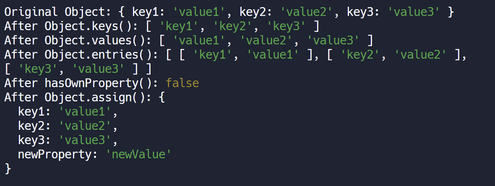

## CLASS

Define the structure of ann functional expression or functional declaration

```js
class Animal {
  constructor(name, legCount) {
    this.name = name;
    this.legCount = legCount;
  }
  describe() {
    return `${this.name} has ${this.legCount} legs`;
  }
  // similar to java
}
```

- ` static` functions: associated with the classes only not a property of objects but of the structure/class. **We can call it directly on the class without instantiating the objects.**

## OBJECTS

```js
// Object Methods Explanation
function objectMethods(obj) {
  console.log("Original Object:", obj);

  let keys = Object.keys(obj);
  console.log("After Object.keys():", keys);

  let values = Object.values(obj);
  console.log("After Object.values():", values);

  let entries = Object.entries(obj);
  console.log("After Object.entries():", entries);

  let hasProp = obj.hasOwnProperty("property");
  console.log("After hasOwnProperty():", hasProp);

  let newObj = Object.assign({}, obj, { newProperty: "newValue" });
  console.log("After Object.assign():", newObj);
  // assigns extra new properties to the original objects
}

// Example Usage for Object Methods
const sampleObject = {
  key1: "value1",
  key2: "value2",
  key3: "value3",
};

objectMethods(sampleObject);
```

- Output:
  
