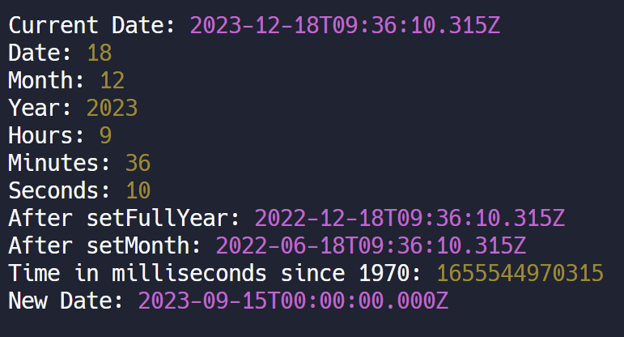

```js
function dateMethods() {
  const currentDate = new Date();
  console.log("Current Date:", currentDate);

  // Getting various components of the date
  console.log("Date:", currentDate.getDate());
  console.log("Month:", currentDate.getMonth() + 1); // Months are zero-indexed, so adding 1
  console.log("Year:", currentDate.getFullYear());
  console.log("Hours:", currentDate.getHours());
  console.log("Minutes:", currentDate.getMinutes());
  console.log("Seconds:", currentDate.getSeconds());

  // Setting components of the date
  currentDate.setFullYear(2022);
  console.log("After setFullYear:", currentDate);

  currentDate.setMonth(5); // Setting month to June (zero-indexed)
  console.log("After setMonth:", currentDate);

  // Getting and setting time in milliseconds since 1970, epoch timestamp
  console.log("Time in milliseconds since 1970:", currentDate.getTime());

  const newDate = new Date(2023, 8, 15); // Creating a new date
  console.log("New Date:", newDate);
}

// Example Usage for Date Methods
dateMethods();
```

- Output(from replit machine):
  

- We can calculate time taken by a program/function to run through the `currDate.getTime()` method. Just run it before running the function and then again. The difference would be the required answer.

- We can run a function in intervals using `setInterval(func,2000)`. (Runs every 2 seconds)
