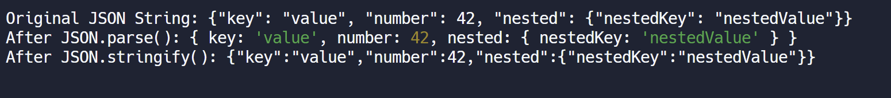

**J**ava**s**cript **O**bject **N**otation

JSON is a format for storing and transporting data.It is often used when data is sent from a server to a web page.

```js
function jsonMethods(jsonString) {
  console.log("Original JSON String:", jsonString);

  // Parsing JSON string to JavaScript object
  let parsedObject = JSON.parse(jsonString);
  console.log("After JSON.parse():", parsedObject);

  // Stringifying JavaScript object to JSON string
  let jsonStringified = JSON.stringify(parsedObject);
  console.log("After JSON.stringify():", jsonStringified);
}

// Example Usage for JSON Methods
const sampleJSONString =
  '{"key": "value", "number": 42, "nested": {"nestedKey": "nestedValue"}}';

jsonMethods(sampleJSONString);
```

- Output:
  
