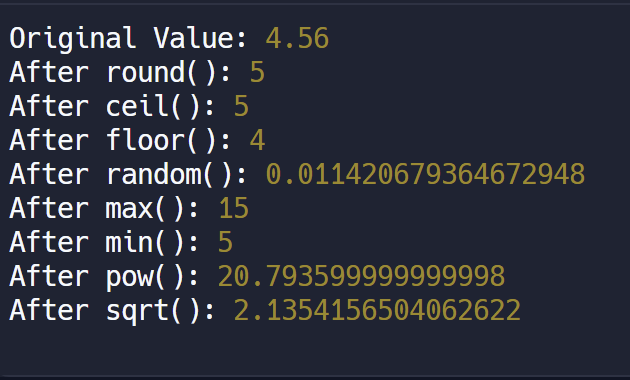

```js
function mathMethods(value) {
  console.log("Original Value:", value);

  let rounded = Math.round(value);
  console.log("After round():", rounded);

  let ceiling = Math.ceil(value);
  // smallest int bigger than val
  console.log("After ceil():", ceiling);

  let flooring = Math.floor(value);
  // biggest int smaller than val
  console.log("After floor():", flooring);

  let randomValue = Math.random();
  console.log("After random():", randomValue);

  let maxValue = Math.max(5, 10, 15);
  console.log("After max():", maxValue);

  let minValue = Math.min(5, 10, 15);
  console.log("After min():", minValue);

  let powerOfTwo = Math.pow(value, 2);
  console.log("After pow():", powerOfTwo);

  let squareRoot = Math.sqrt(value);
  console.log("After sqrt():", squareRoot);
}

// Example Usage for Math Methods
mathMethods(4.56);
```

- Output:
  
