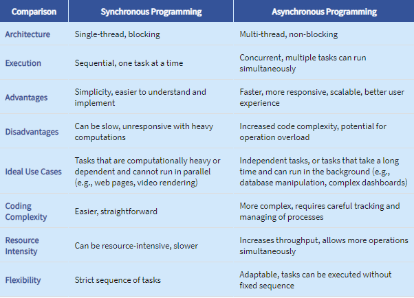
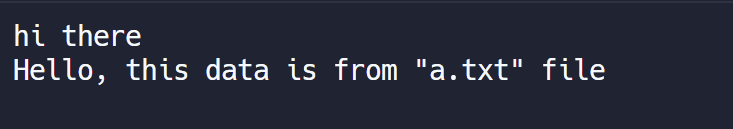

```js
//Example:
function findSum(n) {
  let ans = 0;
  for (let i = 0; i < n; i++) {
    ans += i;
  }
  return ans;
}

function findSumTill100() {
  console.log(findSum(100));
  return findSum(100);
}

setTimeout(findSumTill100, 2000); // async function
console.log("Hello World");
```

- Here, `"Hello World"` would be printed first, then after 2 seconds `findSumTill100` will execute and print `4950`.

##### Main async functions/usecases:

- `setTimeOut` : sleep/wait for a function
- `fs.readFile`/`fs.writeFile` - to read/write a file from your filesystem
  Example:

```js
const fs = require("fs");

fs.readFile("a.txt", "utf-8", function (err, data) {
  //a.txt: sample text file
  console.log(data);
});

console.log("hi there");
```

Output:


- `Fetch` - to fetch some data from API endpoint
- Database Call

#### Note:

- If the control has passed from an async function like `readFile` and it encounters some other complex/time consuming function, the control won't reach the async function back even if it consumes lesser time.

- In this case, the control would syncronously move and then come back for that async function.

- Checkout [Latentflip/loupe](https://latentflip.com/loupe) to understand function control visualisations.
