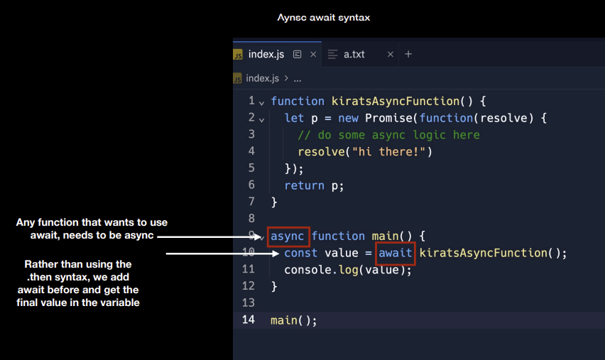
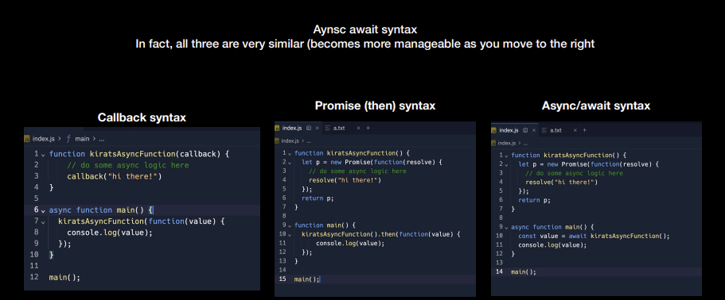

- Here, if we run some function after `main()`, it will be called before the async function we defined as control awaits for `value` but doesn't get stuck there.

- `await` is very important, as without it we would get the promise only, not its real resolved value.

- `async-await` only needs to be defined on the caller side, the promise maker doesn't need to do anything new.

## Callback v/s Promise vs Async/Await

