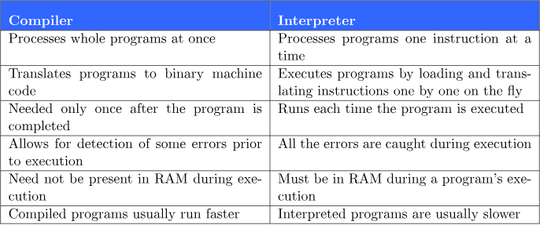

#### Why Languages?

Compilers convert the high-level developer friendly code to 0s & 1s (Binary) to get it processed by CPU and RAM.

#### Interpreted vs Compiled Langs



#### Why JS is better than other languages?

Browsers can only understand HTML/CSS/JS(not technically true).

- JS can be used for **Backend Development** as well.
- Its dynamic and not static - variables can change data type during runtime.
- Single Threaded nature of JS - Always restricted to a single core. Considered to be bad fro scalable systems but there is a way around(subroutines) too.

## Javascript

#### Variables

- let: Can change value
- var: previously used
- const: Constant ( can only define at once)

#### Program Run command: node filename.js

#### Data Types: Strings, numbers, booleans

#### Array Defination:

const arr = [1,2,3]

#### Objects

- Multiple key-values in same variable
- Value Access: object_name[key] or object_name.key

#### Functions

- Take arguments as input return value as output.
- Functions can also take another functions as input(callbacks)

- #### Notations:
  - Normal:
  ```js
  function sum(a, b) {
    return a + b;
  }
  ```
  - Arrow:
  ```js
  const sum = (a, b) => {
    a + b;
  };
  ```

#### Callbacks

- Function calling other function(s)

```js
function calcArithmentic(a,b,arithmentic_func){
    const ans = arithmetic_func(a,b);
    return ans;
}

function sum(a,b){
    return a + b;
}

const value = calcArithmentic(1,2,sum);
const(value);

Printed: 3
```

Another example can be:

```js
function greet() {
  console.log("Hello World");
}

setTimeout(greet, 3 * 1000); // passed function as arg
```
