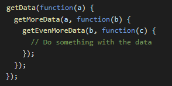
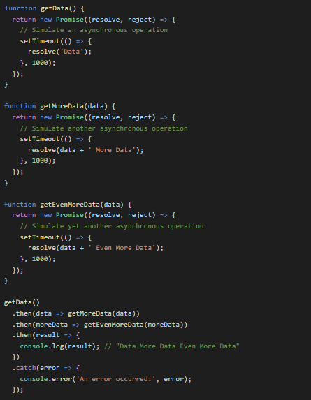
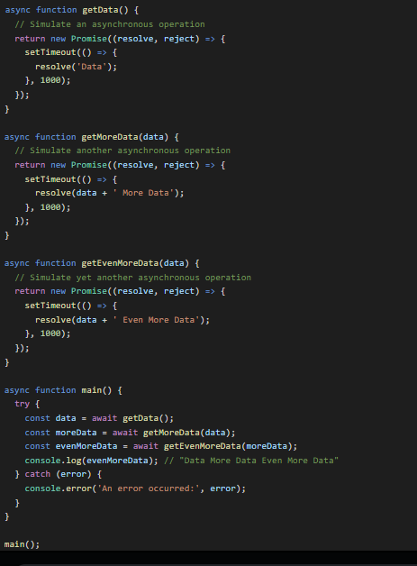

- Also, known as **Pyramid of Doom**.
- Callback Hell is essentially nested callbacks stacked below one another forming a pyramid structure. Every callback depends/waits for the previous callback, thereby making a pyramid structure that affects the readability and maintainability of the code.

Example:

- Code is growing horizontally.
- With prmoises, we can flatten the callbacks and seperately define each function.
- Then make a promise chain to chain our asynchronous functions together in a much more readable and maintainable way.

Example:

- Another better way, using async-await:

