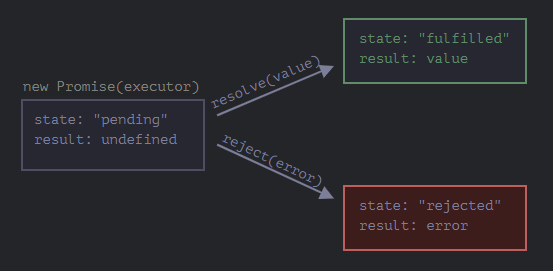
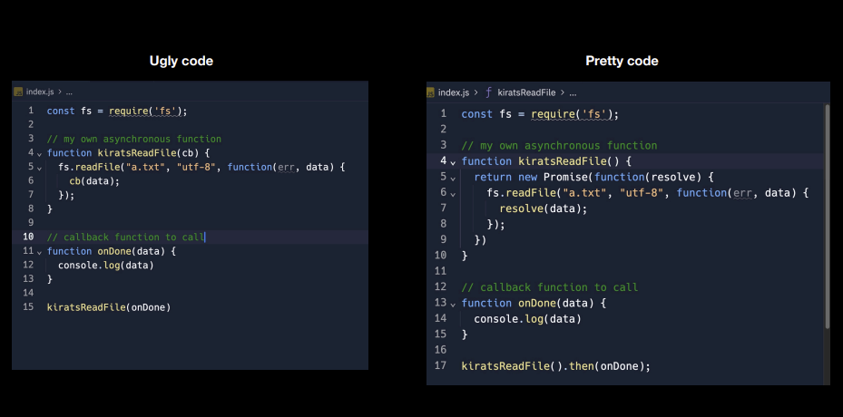
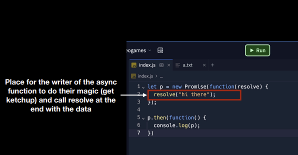

- To manage asynchronous actions in JavaScript, promises are used. It is an assurance that something will be done. The promise is used to keep track of whether the asynchronous event has been executed or not and determines what happens after the event has occurred.
- Promises are syntactical sugar, don't need callback functions but still uses them under the hood.

#### Constructor Syntax for a promise Object:

```js
let promise = new Promise(function (resolve, reject) {});
```

#### Some IMPORTANT POINTS TO NOTE:

1. Before promise we used to depend on callback functions which would result in:
   - Callback Hell (Pyramid of doom)
   - Inversion of control
2. Inversion of control is overcome by using promise.

   - A promise is an object that represents eventual completion/failure of an asynchronous operation.
   - A promise has 3 states: `pending | fulfilled | rejected`.
   - As soon as promise is fulfilled/rejected => It updates the empty object which is assigned undefined in pending state.
   - A promise resolves only once and it is immutable.
   - Using .then() we can control when we call the cb(callback) function.

3. To avoid [`callback hell`](JS-Foundation.promises.callback_hell) (Pyramid of doom) => We use `promise chaining`. This way our code expands vertically instead of horizontally. Chaining is done using ``.then()`
4. A very common mistake that developers do is not returning a value during chaining of promises. Always remember to return a value. This returned value will be used by the next .then()



#### Callbacks v/s Promises:

- Go through the code to have a better understanding of the process.
  

- Promise Body:
  
