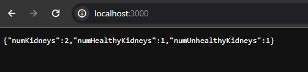

[Node.js](nodejs.md) web application framework

- Not a default node library
- Installantion: `npm i express`
- Leverages upon Node.js single threaded and asynchronous model
- It supports MVC (Model-View-Controller), a very common architecture to design web applications.

- Creating a [HTTP Server](nodejs.http.md)
- To start it : `node index.js`
- Localhost deployed server can be opened on any device using that private network
- req=> request | res=> response

#### Simple Query Catcher deployed on local network/localhost:

```js
const express = require("express");

const app = express();

const sum = (n) => {
  let res = 0;
  for (let i = 0; i < n; i++) {
    res += i;
  }
  return res;
};
app.get("/", (req, res) => {
  const n = req.query.n; // query catching from URL

  const ans = sum(n);
  res.send("Hi,your ans is " + ans);
});
app.listen(3000, () => {
  console.log("listening on port 3000");
});
```

### The user can give the server input in 2 methods:

#### For GET Request

- Using query parameter: Add `?` after the URL and type the query
  Ex: `localhost:3000?a=3&b=2`

- Using input area/box

### Request Methods:

- GET - get data from server/backend
- POST - post data from server/backend
- PUT - update data from server/backend
- DELETE - delete data from server/backend

### Practice: In-Memory Hospital:


```js
const express = require("express");

const app = express();

const users = [
  {
    name: "Mathur",
    kidneys: [
      // np. of kidneys-2
      {
        healthy: false,
      },
      { healthy: true },
    ],
  },
  {
    name: "Mudit",
    kidneys: [
      {
        // no. of kidneys-1
        healthy: false,
      },
    ],
  },
];

// GET TASK----------------------------------
app.get("/", (req, res) => {
  const userKidneys = users[0].kidneys;
  // console.log(userKidneys); // will return the kidneys object from user json object
  const numKidneys = userKidneys.length;
  let numHealthyKidneys = 0;

  for (let i = 0; i < numKidneys; i++) {
    if (userKidneys[i].healthy) {
      numHealthyKidneys++;
    }
  }
  const numUnhealthyKidneys = numKidneys - numHealthyKidneys;
  res.json({
    numKidneys,
    numHealthyKidneys,
    numUnhealthyKidneys,
  });
});
app.use(express.json()); //middleware

// POST TASK--------------------------------
app.post("/", function (req, res) {
  const isHealthy = req.body.isHealthy; // getting user's input through request body
  users[0].kidneys.push({
    // changing the object
    healthy: isHealthy, // updating the mini-database(users object) with clients request
  });
  res.json({ msg: "Done" }); // successful msg
  // can test it out using Postman- post request
});

// PUT TASK--------------------------------------
app.put("/", function (req, res) {
  if (isThereAtleastOneUnhealthyKidney()) {
    for (let i = 0; i < users[0].length; i++) {
      users[0].kidneys[i].healthy = true; // making all kidneys healthy
    }
    res.json({});
  } else {
    // no unhealthy kidneys to work on
    res.status(411).json({ msg: "No work to do" });
  }
});

// DELETE TASK--------------------------------------

function isThereAtleastOneUnhealthyKidney() {
  let atLeastOneUnhealtyKidney = false;
  // returns if there is at least one unhealty kidney
  for (let i = 0; i < users[0].kidneys.length; i++) {
    if (!users[0].kidneys[i].healthy) {
      atLeastOneUnhealtyKidney = true; // keeping
    }
  }
  return atLeastOneUnhealtyKidney;
}

app.delete("/", function (req, res) {
  if (isThereAtleastOneUnhealthyKidney()) {
    const newKidneys = [];

    for (let i = 0; i < users[0].kidneys.length; i++) {
      if (users[0].kidneys[i].healthy) {
        newKidneys.push({
          healthy: true, // only keeping healthy kidneys in the new arr
        });
      }
    }
    users[0].kidneys = newKidneys; // reassigning
    res.json({ msg: "DLT Done" });
  } else {
    // when all kidneys are healthy
    res.status(411).json({ msg: "You have no bad kidneys bruh!" });
  }
});
app.listen(3000, () => {
  console.log("listening on port 3000");
});
```

#### GET TASK

Output Till Here:


---

#### POST TASK

Post Request Test(Postman):


- Used Middleware- `app.use(express.json())` so as to not get the `req.body` undefined.

- After, hitting the post request a few more times our in-memory users object got updated and hence the count of kidneys. This was represnted by the `GET` request too.
  

#### PUT TASK

In-Memory Data gets reset when the sevrer is started again , thats why we need databases.

- After sending the PUT request
  

#### DELETE TASK

- Gets reset to default value
  

- Unhealthy kidneys got removed:
  

#### ERROR CHECKS

1. `isThereAtleastOneUnhealthyKidney()` function checks and returns boolean if there is at least one unhealty kidney. This is checked before sending a `DELETE` request.

   - When there are no bad kidneys to remove:
     

2. We can do the same for `PUT` request too, as we don't have to do anything if all the kidneys are healthy
   - No unhelathy kidneys to work on:
     
