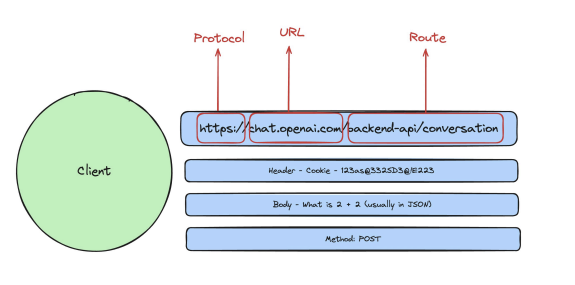

#### HTTP (Hypertext Transfer Protocol)

- Aprotocol that is defined for machines to communicate
- Specifically for websites, it is the most common way for your website's frontend to talk to its backend.

#### HTTP Server

Some code that follows the HTTP Protocol and is able to communicate with clients(browsers/mobile apps...)

Imagine this flow of sequence →

1. You type a website address in the URL bar of your browser. So, you’re **requesting** data that resides in the servers of that website.
2. The ISP redirects your request and checks if they have the data of that address available readily.
3. If they do, you’re given back the data, and it’s all set.
4. If they don’t, they then ping the actual domain server requesting the data.
5. Once they get it, they redirect the **response** back to your IP (your address)
6. Once you get it back, that’s how you see the website.

---

Now, this is the process of opening a website, what about conducting an actual activity within it?

1. You open ChatGPT’s website, and you put in a prompt.
2. That prompt acts as an input for a function that is written in ChatGPT’s server to give you back the data which would act as an appropriate response to your prompt
3. So, inherently, you’re the one providing the input
4. ChatGPT’s server has a function that will accept your input
5. That function will do it’s due diligence in processing it, and then it will return the output.
6. The output will be the response to your request and it will follow the HTTP protocol to reach your browser.



### Client Side Terms→

1. **_Protocol_**
   - `HTTP`: Hyper Text Transfer Protocol
   - `HTTPS`: Hyper Text Transfer Protocol “**Secure”** - To save data from getting sniped
2. **_Address_**
   - `URL`: Something like “chat.open.ai”, or “www.google.com”
   - `IP`
   - `Port`
3. **_Route_**:

   Specific path to the function that you’re calling. _(Usually, things are hyperlinked, and it automatically takes the path that you’d want to go to depending on the button you’ve clicked on, in the front-end)_

4. **Headers/Body/Query Parameters**

   - **_Header -_** You send many headers when you’re sending a request.
     1. One of those many headers is the **_Cookie_** that ensures whether you’re authenticated to access the functionalities of a given back end server at a given time or not.
   - **_Body -_**The most important part, probably
     1. It outlines your request’s crux. What exactly you are asking for in the request.
     2. It’s like the “argument” you send to the function you’re trying to get a response from

5. **_Method_**
   - What are you trying to achieve?
   - Adding some data on to the server? `POST` request
   - Requesting some data that already exists in the server’s database? `GET` request
   - Updating something? `PUT` request
   - Deleting something? `DELETE` request

- We can view the network request with their respective headers, the route and the authorization(cookie), status code INT THE `Network` tab. Body can be vioewed in the `Payload` section.

### Server-side terms →

1. **_Response Headers -_** Usually this is in context to your authorization token that we need to store, but we shouldn’t have to worry a lot about it otherwise.
2. **_Response Body -_** This is the crux of what you want out of your request.
3. **_Status Codes -_**

   - **200** - OK
   - **500** - Internal Server error
   - **404** - Page not found
   - **403** - Authentication issues

   ### Q. Explain the sequence of events that happen after you type in "www.google.com" in the browser's URL field.

**_In the browser_** →

1. Browser parses the URL
   - It segregates the domain name, the route within that domain name, the protocol, etc.
2. It does a DNS (Domain Name Service) lookup
   - It basically maps the given URL to it’s respective IP address.
   - Think of it like, every website has their own numerical address, which is mapped in a directory that we call DNS.
3. Establishes a connection with the IP
   - Handshake protocol, and all the computer networks stuff

**_In the server_** →

1. Receives the input request (body, header, route)
2. Logical processing
3. Return the output in the form of a response (body, header, status codes)

#### Creating our own HTTP Server:

```js
const express = require("express");
const bodyParser = require("body-parser");
const port = 3000;

const app = express();
app.use(bodyParser.json());
app.get("/check-route", function (req, res) {
  res.send("Rohan Sharma");
});

app.post("/backend-convo", function (req, res) {
  const message = req.body.message;
  console.log(message);

  res.json({
    output: "2+2 = 4",
  });
});

app.get("/", function (req, res) {
  res.send("Hello World");
});

app.listen(port, function () {
  console.log(`Example app listening on port ${port}`);
});
```

1. Import `express`
2. Initializes an instance for `express`
3. Creates multiple routes that you can work with, and process different logics.
4. You can test it by going to your browser and entering `[localhost:3000](http://localhost:3000)` and also `localhost:3002/check-route`

- Server can also interpret `HTML`.
- To log whatever the user is sending through `app.post` (we can send through Postman) we can get its body parsed through `bodyParser`.

```js
app.use(bodyParser.json());
```
